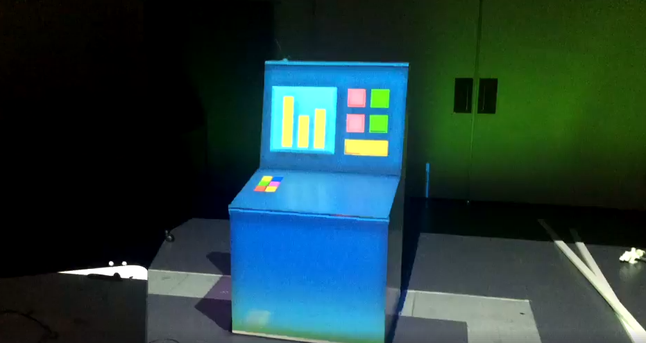

# Console Editor
Console Demo which uses a tablet and SAR to populate a control panel with objects. 

### How to Setup
 1. Create a directory at the path C:/SAR/Calibration Data/Console Editor, this is the Calibration Data Directory.
 2. Calibrate one projector onto the console, place intrinsic and extrinsic in Calibration Data Directory with file names IntMat.dat and ExtMat.dat respectively.
 3. Using the intrinsic and extrinsic matrices, capture a Coordinate Space Transformation matrix using Coordinate Space Transformer. Place the matrix in the Calibration Data Directory with file name CstMat.dat
 4. Using the aforementioned matrices, capture Offset Matrices for the stylus and console using Offset Saver. Input meshes for the Offset Saver can be found in ./Calibration Data/. Place the matrices in the Calibration Data Directory with file names StylusOffsetMat.dat and ConsoleOffsetMat.dat respectively.

### Known Bugs

### Screenshots

Example images of the SAR project. 

Console Demo.
- Uses Motive Tracking Software to track the console and a pen for selecting items.
- Additionally uses a tablet on the local network to add items to the console and change tools.

### Authors
Adam Mark Drogemuller